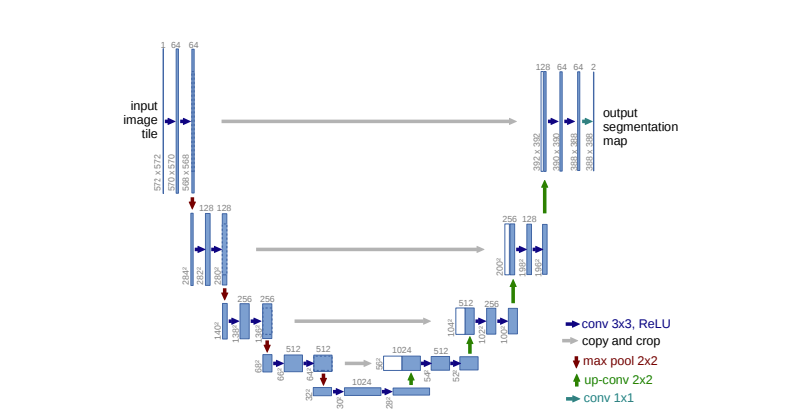
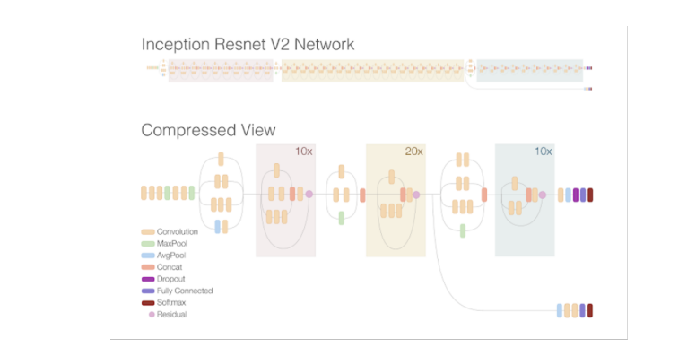

# Zero-Shot-Video-Segmentation-with-Static-Images

Convolutional neural networks have shown exemplary results
in all domains of computer vision, with the availability of large datasets
which are annotated. This method is highly effort taking when it comes
to dealing with annotating videos, pixel wise and using it for training.
With video object segmentation methods becoming more in number and
ubiquitous in most of the light devices such as mobile phones and microcontrollers, it is essential to build a segmentation architecture that does
not rely on temporal continuity on propagation of masks. Existing models with Spatio temporal correlations tend to increase the computational
complexity on light devices. To serve the above-mentioned purpose, we
built a model that does video object segmentation considering each frame
as a static image. We make the model work on smaller datasets with the
transfer learning approach. Our method can be described as a Zero Shot
Video Object Segmentation with Static images using transfer learning

###U-net Architecture 

###Performance of U_net

###Inception ResnetV2 Architecture

###Performance of U_net

By exploiting offline
training with image annotations only, our approach is able to produce accurate
video object segmentation.Different from current popular supervised VOS solutions requiring extensive amounts of elaborately annotated training samples,
our model attains good results with only offline training.

This project was done in colaboration with Mohammed Maqsood
Shaik GowthamKrishna Addluri